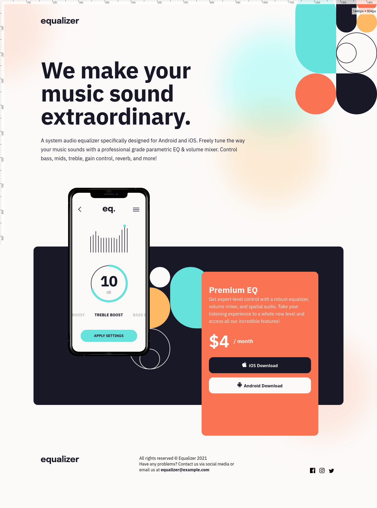
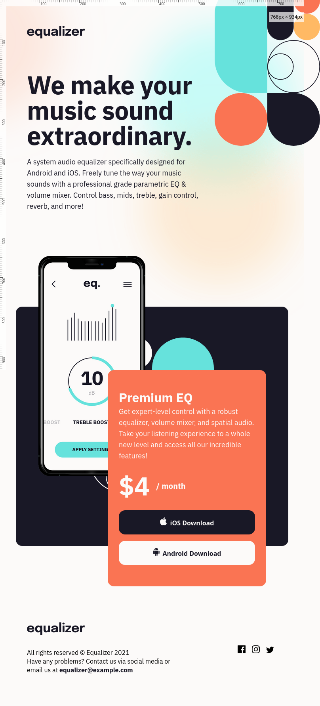

# Frontend Mentor - Equalizer landing page solution

## My process

Broke it down to how I was going to do each section. Laid out the structure in html then went at it.

### What I learned

Still am learning but figured a trick to change svg colors on hover. Messy looking in html. Playing around with background images was new for me.

### Screenshot

